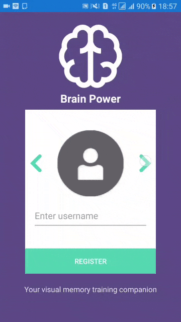
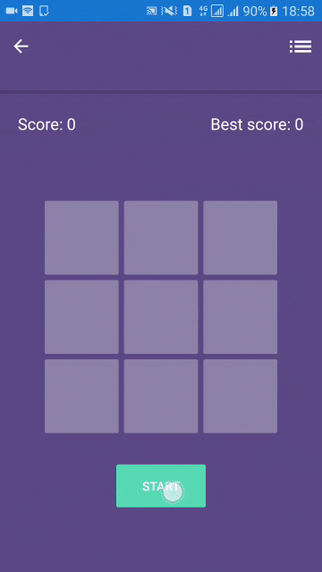
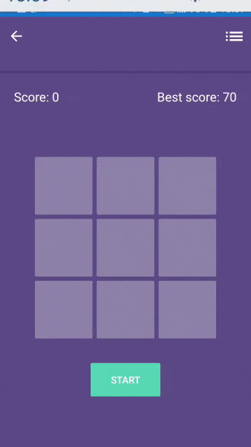

# BrainPowerApp

A visual memory training game, a mobile game made with Xamarin for both Android and IOS .

## Demo Gifs:
   

## Game logic:
You have to remember the boxes' positions selected by the app randomly, replay the sequence and try to get the best score possible.

## Tools used:
* Xamarin forms (Framework)
* C# (logic)
* Xaml (Design)
* Visual studio (IDE)

## TODO:
- [ ] Add login form to authenticate user.
- [x] Make the Grid layout fit any screen size.
- [x] Adding leaderboard using my own API.
- [x] Adding more UI elements and SFX.

## Contributing
Feel free to `fork` this project and add whatever you like (Helping with the TODOs would be amazing tho). If you have any suggestions or any comments please feel free to contact me or to open an issue.

## Team:
[Jetlighters](https://github.com/JetLightStudio) having fun.

